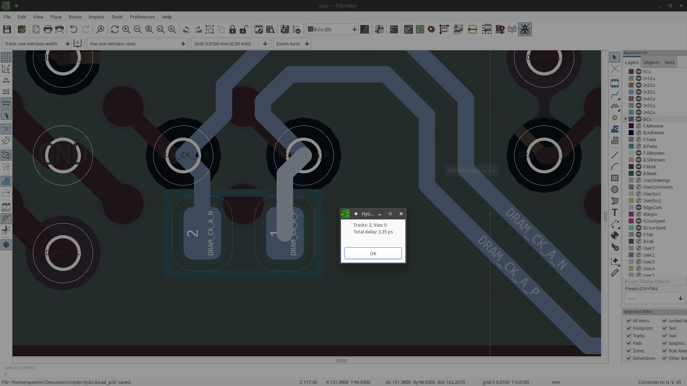

# flytools

## About

Project contains 3 different tools:

- [flytools.py](flytools.py) library for calculating delay of tracks / vias and updating a spreadsheet with each net's delay.

- [flytime.py](flytime.py) GUI tool that displays the delay of a reference and target net, taking into account package and extra delays from a spreadsheet, and updates when the PCB file is saved

- [flyselected_action.py](flyselected_action.py) KiCad action plugin that calculates the delay of all selected elements, used for calculating extra delays of stubs on a net.

Uses [pyfltk](https://pyfltk.sourceforge.io/) and
[pyopenxl](https://openpyxl.readthedocs.io).

## Limitations

- Uses physical length of traces, not electrical length

- Only works for simple point to point nets.

- Track / Via info must be added to a flytime info json file (see
[flytime_info_example.json](flytime_info_example.json)) and cannot be
generated from the board stackup because the BOARD_STACKUP class
is not exposed by the python API.

- Extra stubs must be calculated manually and subtracted from the
"Extra Delay" column in flytime spreadsheet.
