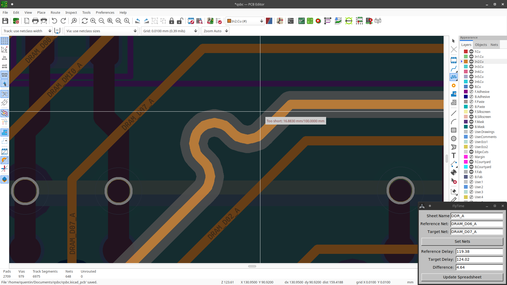
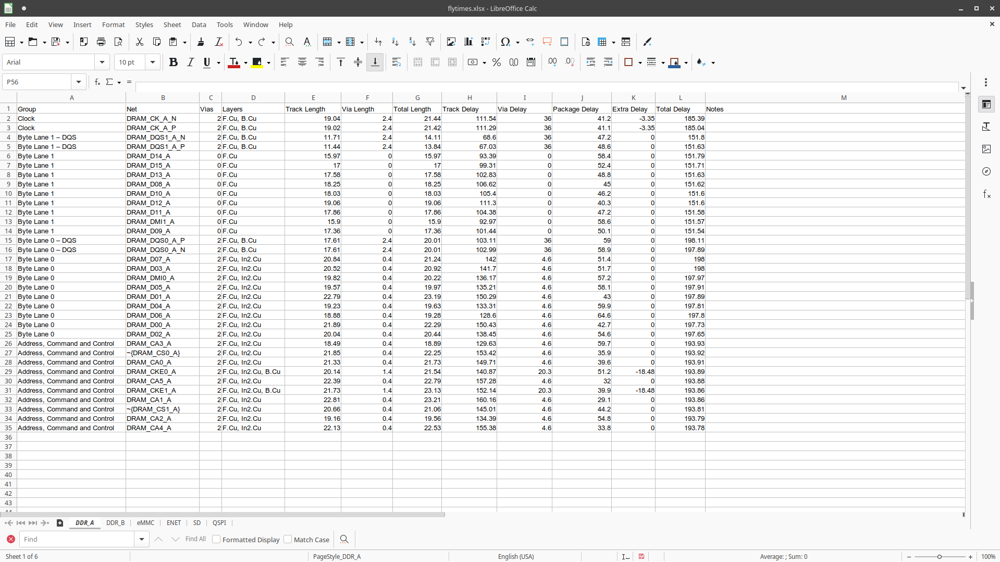

# flytools

## About

Python script for length matching in the time domain in KiCad.

Uses [pyfltk](https://pyfltk.sourceforge.io/) and
[pyopenxl](https://openpyxl.readthedocs.io).

## Limitations

- Uses physical length of traces, not electrical length

- Only works for simple point to point nets.

- Track / Via info must be added to a flytime info json file (see
[flytime_info_example.json](flytime_info_example.json)) and cannot be
gerenated from the board stackup because the BOARD_STACKUP class
is not exposed by the python API.

- Extra stubs must be calculated manualy and subtracted from the
"Extra Delay" column in flytime spreadsheet.

## TODO

- Convert to pcbnew plugin to avoid reload of board file.
